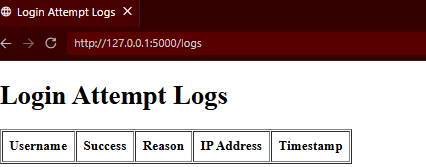
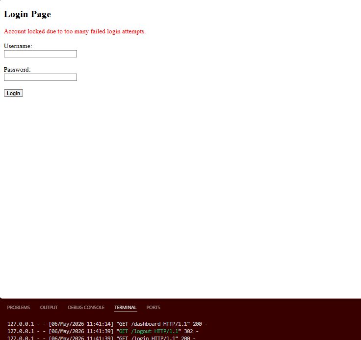
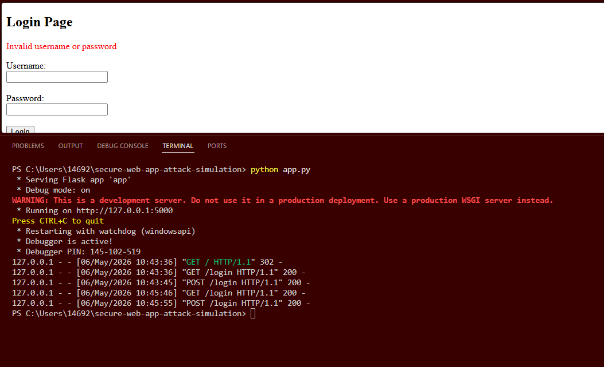
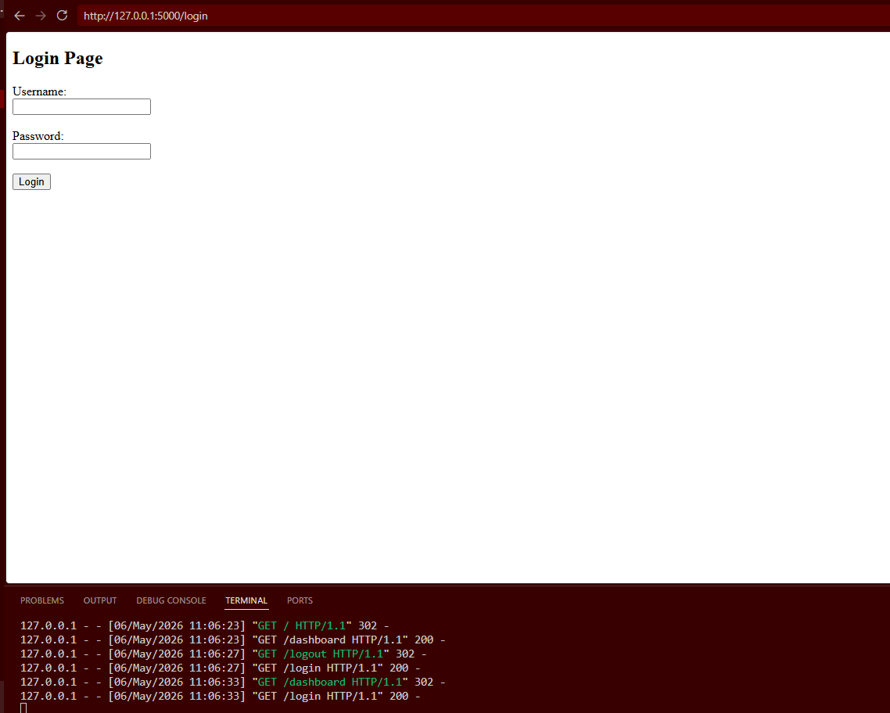
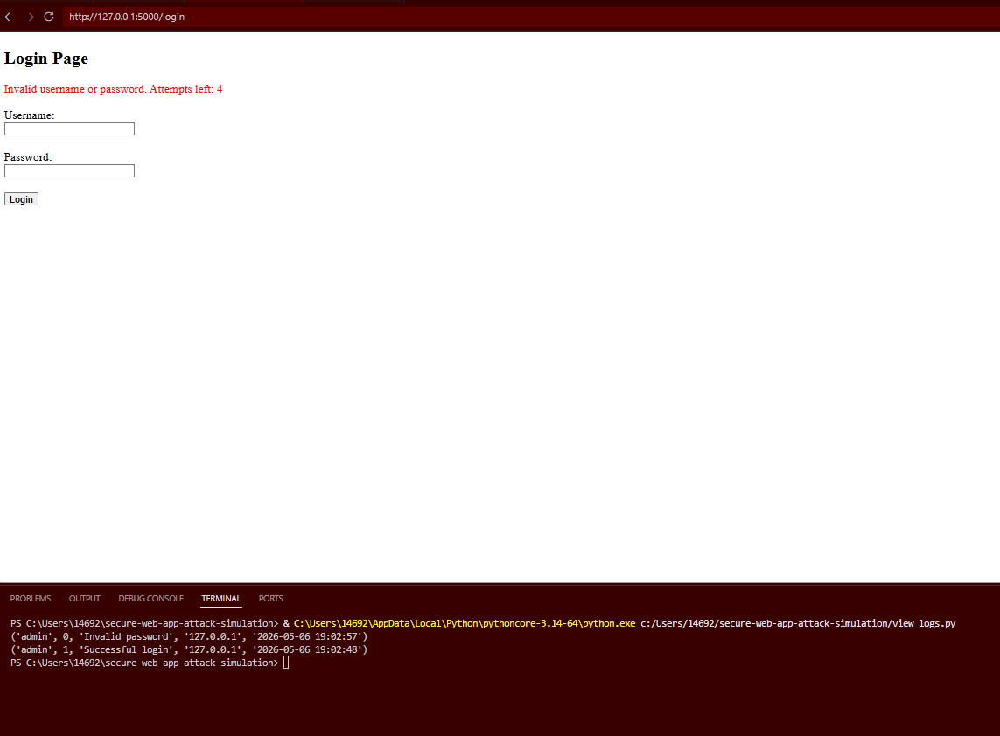

# Secure Web App — Attack & Defense Simulation

A hands-on Application Security project demonstrating how common web vulnerabilities are exploited and remediated. Built with Python and Flask, this app simulates a real penetration testing engagement: identify the vulnerability, exploit it, fix it, and verify the fix.

## Vulnerabilities Demonstrated

| Vulnerability | CWE | Status |
|---|---|---|
| SQL Injection (Authentication Bypass) | CWE-89 | ✅ Exploited & Remediated |
| Brute-Force Attack | CWE-307 | ✅ Detected & Mitigated |
| Plaintext Password Storage | CWE-256 | ✅ Fixed with bcrypt |
| Insecure Session Handling | CWE-384 | ✅ Fixed |
| Missing Access Controls | CWE-284 | ✅ Fixed |

## Attack Walkthrough

### SQL Injection — Authentication Bypass

The initial vulnerable query accepted raw user input:

```python
# VULNERABLE — string concatenation
query = "SELECT * FROM users WHERE username = '" + username + "' AND password = '" + password + "'"
```

This allowed authentication bypass using the classic payload:
Username: admin' OR '1'='1' --
Password: anything

### Remediation Applied

```python
# SECURE — parameterized query
cursor.execute("SELECT * FROM users WHERE username = ?", (username,))
```

Input is treated strictly as data, never as executable SQL.

## Security Controls Implemented

**Password Security**
- Passwords hashed using bcrypt — plaintext storage eliminated
- Secure password verification on login

**Session Management**
- Session-based authentication with protected routes
- Logout functionality clears session data
- Dashboard access restricted to authenticated users

**Brute-Force Protection**
- Account lockout after 5 failed login attempts
- Prevents automated credential stuffing attacks

**Detection & Monitoring (SIEM-Style)**
- All authentication events logged with: username, success/failure, failure reason, IP address, timestamp
- Brute-force alert triggered when threshold exceeded
- `/logs` endpoint restricted to admin users only

## Tech Stack

- **Backend:** Python, Flask
- **Database:** SQLite
- **Security:** bcrypt, parameterized queries, session controls
- **Testing:** Burp Suite (HTTP interception & payload delivery)

## Project Structure
secure-web-app-attack-simulation/
├── app.py              # Main Flask application
├── database.py         # DB setup and query logic
├── view_logs.py        # Log viewer (admin only)
└── templates/
├── login.html
├── dashboard.html
└── logs.html

## How to Run

```bash
# 1. Install dependencies
pip install flask bcrypt

# 2. Initialize the database
python database.py

# 3. Run the application
python app.py

# 4. Open in browser
http://127.0.0.1:5000
```

## Testing Scenarios

| Scenario | Steps | Expected Result |
|---|---|---|
| Valid login | Enter correct credentials | Redirects to dashboard |
| SQL injection attempt | Username: `admin' OR '1'='1' --` | Blocked — parameterized query prevents bypass |
| Brute-force | 5+ failed logins | Account locked |
| Log access (non-admin) | Access `/logs` as regular user | Access denied |

## Skills Demonstrated

`Python` `Flask` `SQLite` `bcrypt` `SQL Injection` `Authentication Security` `Session Management` `Access Control` `Brute-Force Mitigation` `Security Logging` `OWASP Top 10` `Burp Suite`

## Key Takeaway

This project demonstrates not just how vulnerabilities are exploited, but how they are prevented, monitored, and detected in a real-world application — replicating the full workflow of an application security engagement.

## Screenshots

### Admin login


### Locked account


### Password hashing


### Redirect login


### SIEM Log

